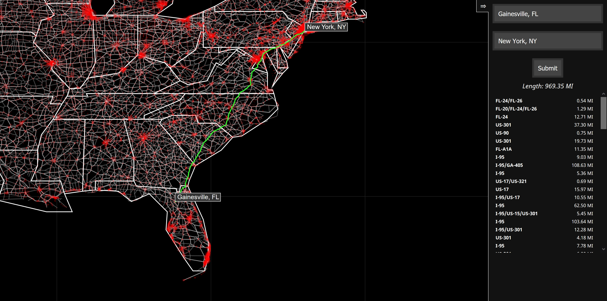

# US Route Mapping

<https://nallantli.github.io/US-Route-Mapping/>



Took data from a dataset of US roads, cities, and intersections and put it into a website. Works? Yes. Slow? ~~Yes.~~ Not anymore!

A* is surprisingly fast for having to search through 28k nodes.

Use WASD to move around and Q and E to zoom in and out. Scrolling also zooms in and out; although currently a little buggy.

Data is taken from <http://rabbit.eng.miami.edu/>. I don't go to UM but a friend does and I just took data he used for one of his projects ¯\\\_(ツ)\_/¯

I do not know where the professor sourced his data. If you know, please tell me; I'd like to see if anything has been updated or if there is more data to try out. Also, maybe an explanation for what the different types of connections mean (`T--`, `P--`, `O--`, etc.).

The data is converted from the files [connections.txt](data/connections.txt), [intersections.txt](data/intersections.txt), and [named-places.txt](data/named-places.txt) using a Java file (for speed) into JSON that is then interpreted by the main generator.

JSON for cities appears as so:

```json
{
    "id":"51225175",
    "state":"FL",
    "name":"Gainesville",
    "pop":"95447",
    "area":"48.182346",
    "lat":"29.665245",
    "lon":"-82.336097",
    "intersection":"27342",
    "distance":"0.7745"
}
```

JSON for nodes/intersections appears as so:

```json
"27342":{
    "id":"27342",
    "state":"FL",
    "lat":"29.6527",
    "lon":"-82.3391",
    "neighbors": {
        "27340": [
            {
                "name":"FL-24/FL-26",
                "type":"T--",
                "length":"0.535"
            }
        ],
        "27348": [
            {
                "name":"FL-26",
                "type":"T--",
                "length":"4.845"
            }
        ],
        "27352": [
            {
                "name":"US-441/FL-24",
                "type":"P--",
                "length":"0.733"
            }
        ],
        "27310": [
            {
                "name":"US-441",
                "type":"P--",
                "length":"3.098"
            }
        ]
    }
}
```

Feel free to use the data, converted or raw, for your own projects.
